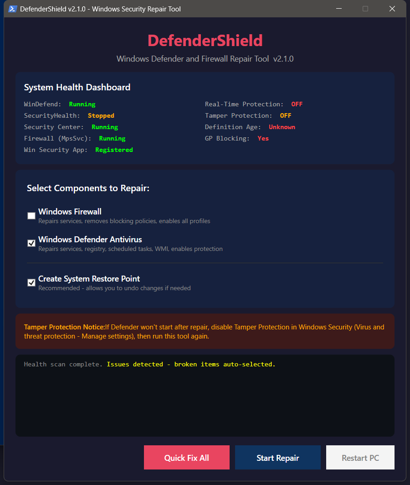

# DefenderShield


Windows Defender and Firewall repair tool for reversing privacy-tool and debloater breakage.



## Features

- Dark WPF GUI with health dashboard tiles for Defender, Firewall, Tamper Protection, signature age, and third-party AV.
- Async GUI repair worker with streaming log, progress indicator, and generated HTML repair report.
- CLI mode for PDQ, Intune, SCCM, local repair, status snapshots, snapshot diffing, watchdog tasks, and WinRM fleet repair.
- Dry-run mode that records every planned action without writing system changes.
- Undo manifest for registry, service, task, WMI, Appx, AppLocker, firewall, and Defender preference changes.
- Firewall rule preservation before reset, with custom rules exported and re-imported.
- Policy audit for registry, service, WMI, scheduled task, Group Policy, AppLocker, SRP, MDE, and Windows Update blockers.
- DefenderControl undo artifact replay when local `.reg` restore artifacts are found.
- Repairs Defender services, drivers, scheduled tasks, WMI subscriptions, Group Policy, Windows Security app registration, SmartScreen, MDE Sense, and Defender signature dependencies.
- Repairs Windows Firewall services, policies, profiles, and dependency startup order.
- Offline third-party AV uninstall guidance when another AV is registered as the active provider.
- Portable mode that writes logs, reports, and backups under `.\Logs\`.

## Requirements

- Windows 10 or Windows 11
- Windows PowerShell 5.1 or later
- Administrator rights for repair, watchdog install/remove, and system changes
- WinRM enabled for fleet mode

## Run

GUI:

```powershell
Set-ExecutionPolicy -ExecutionPolicy Bypass -Scope Process -Force
.\DefenderShield.ps1
```

Status:

```powershell
.\DefenderShield.ps1 -Mode Status
.\DefenderShield.ps1 -Mode Status -Json
.\DefenderShield.ps1 -Mode Status -SnapshotPath .\status-before.json
.\DefenderShield.ps1 -Mode Status -CompareSnapshot .\status-before.json
```

Repair:

```powershell
.\DefenderShield.ps1 -Mode Both
.\DefenderShield.ps1 -Mode Both -DryRun
.\DefenderShield.ps1 -Mode Defender -Only Services,Registry,Tasks
.\DefenderShield.ps1 -Mode Both -Skip SmartScreen
.\DefenderShield.ps1 -Mode Both -Portable
```

Automation:

```powershell
.\DefenderShield.ps1 -InstallWatchdog
.\DefenderShield.ps1 -RemoveWatchdog
.\DefenderShield.ps1 -Mode Both -ComputerName PC-01,PC-02
```

## Module Package

Build a local module package:

```powershell
.\build-module.ps1
```

Install from the built package folder:

```powershell
$modulePath = "$HOME\Documents\WindowsPowerShell\Modules\DefenderShield\3.1.0"
New-Item -Path $modulePath -ItemType Directory -Force | Out-Null
Copy-Item -Path .\dist\DefenderShield\3.1.0\* -Destination $modulePath -Recurse -Force
Import-Module DefenderShield
Invoke-DefenderShield -Mode Status
```

The manifest is ready for `Publish-Module` once a PSGallery API key is available.

## Files Created

| File | Default location | Purpose |
| --- | --- | --- |
| `DefenderShield_[timestamp].log` | Desktop or `.\Logs\` | Streaming operation log |
| `DefenderShield_Backup_[timestamp]\` | Desktop or `.\Logs\` | Registry exports, WMI reports, firewall policy backups, undo manifest |
| `DefenderShield_Report_[timestamp].html` | Desktop or `.\Logs\` | Color-coded repair report |
| `undo-manifest.json` | Backup folder | Structured rollback data for every captured change |
| `custom-firewall-rules.json` | Backup folder | Export of custom firewall rules preserved across reset |
| `wmi-subscription-report.json` | Backup folder | WMI subscriptions found and removed |

## Exit Codes

| Code | Meaning |
| --- | --- |
| `0` | Success or healthy status |
| `1` | Partial repair or issues detected in status mode |
| `2` | Failed repair or command error |
| `3` | Repair blocked by active third-party AV |

## Tamper Protection

If Defender still will not start after repair:

1. Open Windows Security.
2. Go to Virus and threat protection, then Manage settings.
3. Turn Tamper Protection off.
4. Run DefenderShield again.
5. Turn Tamper Protection back on.

## Safety

DefenderShield runs locally. It does not collect data or make network calls except Microsoft Defender signature updates initiated through Windows.

Backups and an undo manifest are written before destructive repair steps when possible. Some repairs still require a reboot before Windows reports healthy state.

## License

MIT. See [LICENSE](LICENSE).
